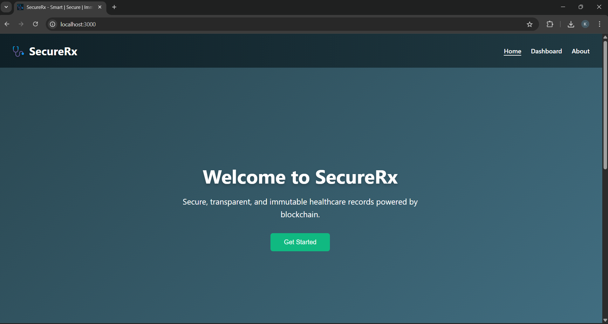
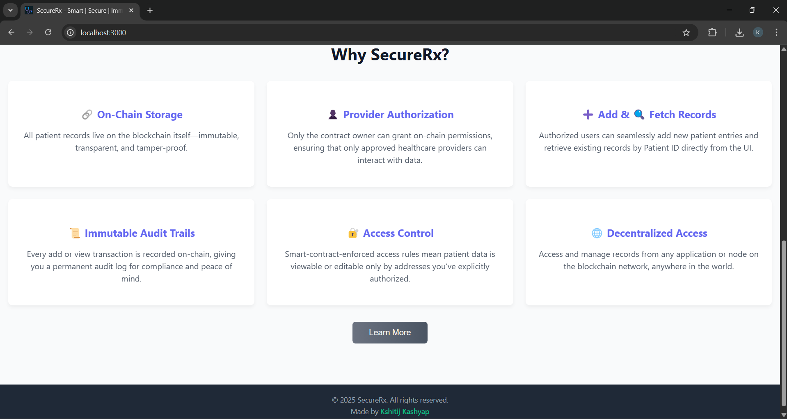
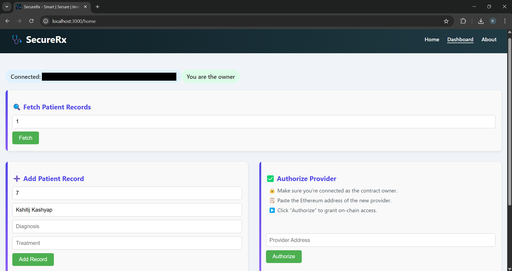
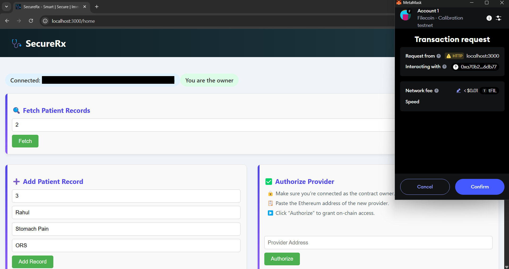
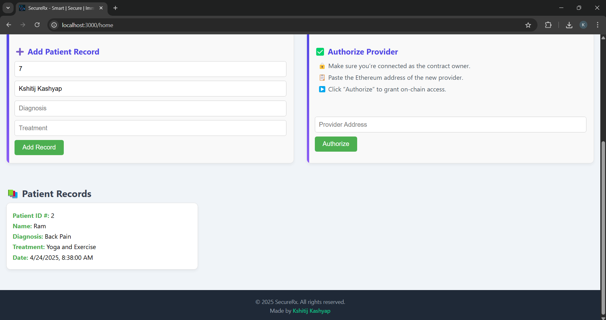

# SecureRx
SecureRx is a blockchain-powered healthcare application that enables secure storage, retrieval, and management of patient records. It ensures immutability, transparency, and fine-grained access control via smart contracts.

## 🚀 Features
- **On-Chain Storage**: All patient records live on the blockchain—immutable and tamper-proof.
- **Provider Authorization**: Only the contract owner can grant on-chain permissions to healthcare providers.
- **Add & Fetch Records**: Authorized users can add new patient entries and retrieve records by Patient ID.
- **Immutable Audit Trails**: Every add/view transaction is recorded on-chain for compliance and auditing.
- **Role-Based Access Control**: Smart-contract enforced rules ensure only authorized addresses can view or edit data.
- **Global Accessibility**: Access and manage records from any application or node on the blockchain network.

## 🖥️ Tech Stack
- **Frontend**: React.js, React Router
- **Blockchain**: Ethereum-compatible network (e.g., Rinkeby, Polygon)
- **Smart Contracts**: Solidity, Ethers.js
- **Styling**: CSS (glassmorphism, gradients)

## ⚙️ Prerequisites
1. Node.js (v14+)
2. npm or yarn
3. MetaMask or other Web3 wallet

## 🔧 Installation
1. Clone the repository:
```
git clone https://github.com/kshitij7704/SecureRx
cd SecureRx
```

2. Install dependencies:
```
npm install
# or
yarn install
```

3. Using RemixIDE or Hardhat and Healthcare.sol, get your own contract address and ABI:
Healthcare.sol
```
SecureRx/
├── contract/
    └── Healthcare.sol
```
Create a .env file in the project root and add your contract address:
```
REACT_APP_CONTRACT_ADDRESS=0xYourContractAddressHere
```
OR 

Alternatively
Create Contract.js as
```
SecureRx/
├── src/
    ├── constant/
        └── Constant.js
```
Contract.js
```
export const CONTRACT_ADDRESS = <YOUR_CONTRACT_ADRESS>
export const CONTRACT_ABI = <YOUR_ABI>
```

5. Start the development server:
```
npm start
# or
yarn start
```
Visit http://localhost:3000 and connect your Web3 wallet.

## 📂 Folder Structure
```
SecureRx/
├── contract/
│   └── Healthcare.sol
├── public/
│   └── index.html
├── src/
│   ├── components/
│   │   ├── AddRecord.js
│   │   ├── AuthorizeProvider.js
│   │   ├── Footer.js
│   │   ├── Home.js
│   │   ├── LandingPage.js
│   │   ├── Navbar.js
│   │   ├── PatientRecords.js
│   │   └── About.js
│   ├── css/
│   │   ├── AddRecord.css
│   │   ├── AuthorizeProvider.css
│   │   ├── Footer.css
│   │   ├── Home.css
│   │   ├── LandingPage.css
│   │   ├── Navbar.css
│   │   ├── PatientRecords.css
│   │   └── About.css
│   ├── constants/
│   │   └── Contract.js
│   ├── App.js
│   ├── index.js
│   └── App.css
└── README.md
```

## 📸 Output Screenshots

- **Home Page**



- **About Page**


- **Dashboard**


- **Add Patient Record**


- **Patient Records**


## 🤝 Contributing
Contributions are welcome! Please open an issue or submit a pull request.
